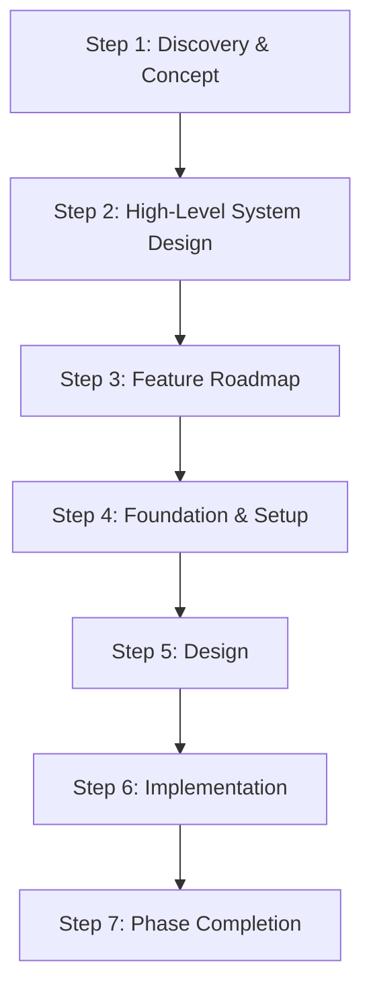

# Domain Flow

Software Development Design Flow methodology for AI-assisted development.

## Overview

Domain-Driven Development (DDD) methodology with hybrid Waterfall-Agile approach. Build applications with AI coding agents through structured documentation and domain-driven design.

## Quick Start

```bash
# Set up prompts
export SYMLINKS_TARGET_DIR="~/your-project/.claude/commands"
ln -s ./prompts/* $SYMLINKS_TARGET_DIR/

# Set up templates
export SYMLINKS_TARGET_DIR="~/your-project/docs"
ln -s ./templates/* $SYMLINKS_TARGET_DIR/

# Set up agents
export SYMLINKS_TARGET_DIR="~/your-project/.claude/agents"
ln -s ./agents/* $SYMLINKS_TARGET_DIR/
```

## Core Components

- **[workflow.md](workflow.md)** - 7-step methodology
- **[prompts/](prompts/)** - 17 AI coding prompts
- **[templates/](templates/)** - 22 document templates
- **[agents/](agents/)** - Specialized AI agents
- **[STEERING.md](STEERING.md)** - AI context instructions (like CLAUDE.md)

## 7-Step Workflow



## Key Features

### Domain-Driven Design

- Dynamic domain discovery via Context.toml
- Domain isolation with clear boundaries
- GRAPH_TAG system for component tracking
- 4 DTO pattern for frontend/backend communication

### AI Agent Integration

- Context analysis and architecture discovery
- Specialized prompts for each development phase
- Dynamic workspace configuration
- Template-driven documentation generation

## Usage

1. **Discover domains** dynamically
2. **Use prompts** for each development phase
3. **Follow templates** for consistent documentation
4. **Leverage agents** for architecture analysis

## Project Structure

```tree
domain-flow/
├── workflow.md                  # Main methodology
├── prompts/                     # AI prompts (17 files)
├── templates/                   # Document templates (22 files)
├── agents/                      # AI agents
├── STEERING.md                  # AI context instructions
└── docs/domains/                # Domain documentation
```

## Getting Started

1. Clone the repository
2. Set up symbolic links using commands above
3. Follow Step 1.1 for new projects

## License

[MIT License](./LICENSE)
