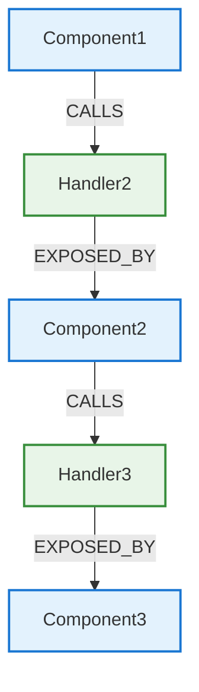

# Graph Model for System Architecture - Ontology

## Overview

This document defines the graph database model (ontology) for representing system components and their interactions. The model supports granular interaction operations with directional data flow.

The documents that store the graph model are:

- docs/domains/<domain>/components.md - the list of components for the current domain and their features/responsibilities
- docs/domains/<domain>/components.yaml - the registry of components with handlers for the current domain
- docs/domains/<domain>/transactions.yaml - the registry of transactions for the current domain

Conceptual diagram of 3 components and their interaction (EXAMPLE):

## Codebase Implementation

Implemented in the codebase (have GRAPH_TAG):

- Nodes:
  - Components (classes, functions, etc),
  - Handler (a function of a component that handles a call from another component)
  - DTOs (data classes, interfaces, etc)

Additional Nodes Entities that are not a part of the graph yet:

- **Transaction** - a set of consecutive steps across a chain of multiple components (handlers) (e.g., from a user click via api, services and to the DB, and back to the frontend). Frontend transactions can be of two types:
  1. Tranactions for Store Access - TSA - when a ui component calls a store method to get a data from it (may then invoke a regulat transaction to update the stoe or not if cached value is available)
  2. Regular transactions - T - traversing multiple layers, typycally start from a frontend Store component, goes to backend and DB and back to the frontend store

These abstract entities IDs are provided as properties of the graph components
Note: Interactions can be transferred to the graph model as nodes in the future

## Node Types (Labels of the graph nodes)

All definitions below are schema-level (they describe node types and relationships in the ontology).

Any concrete values shown (e.g., B2.2, PropertyService, PropertyListRequest) are illustrative examples only, not actual nodes in the graph. The actual graph will be populated later from the system’s codebase and documentation.

### 1. Component

Represents a system component (e.g., a View, Service, Router, Database, etc)

#### Properties

- name: String (<layer_letter>.<domain_number>.<component_number>.<component_name>, e.g., F2.1.PropertiesView)
- domain: String (e.g., "prop", "auth")
- description: String (text description of the component main functionality)
- implementation: String (path to the component file, e.g., "/frontend/components/properties-view.tsx", or if the implementation of the components does not takes the whole file - shared with other components - include the class/function name, e.g., "backend/db/models.py::Property")
- transactions: List[str] (list of transaction IDs it participates in, e.g., ["T2.1", "T2.2", "T2.3", "T2.4", "T2.5", "T2.6"])
- status: String (e.g., "IMPLEMENTED", "NOT_IMPLEMENTED", "PLANNED")

- layer: String (e.g., "frontend", "backend", "database", "external")

**Note:**

- Components are connected via chain: ComponentSource -->Handler --> ComponentTarget
- each Component can be a source or target of multiple interactions with other Components

### 2. **Handler**

Represents a public endpoint or method of a component that is used by other components

Properties:

- name: String (H-<component-owner id>.<handler_name>, e.g., H-F2.1.RetrievePropertyList, H-B2.2.ResponsePropertyList)
- domain: String (e.g., "prop", "auth")
- description: String
- transactions: List[str] (list of transaction IDs it participates in, e.g., ["T2.1", "T2.2", "T2.3", "T2.4", "T2.5", "T2.6"])
- implementation: String (path to file and function name - handler, e.g., "backend/domains/prop/property_service.py::create_property(), "frontend/src/domains/prop/use-properties.tsx::handlePropertyCreation()"
- status: String (e.g., "IMPLEMENTED", "NOT_IMPLEMENTED", "PLANNED")

- type: String ("ENDPOINT" for REST/API, "METHOD_CALL" for internal calls, "ORM_OPERATION" for database operations)
- path: String (e.g., "/api/properties", "/api/properties/{property_id}" - for api endpoints only)
- method: String (e.g., "GET", "POST", "PUT", "DELETE" - for api endpoints only)
- authentication: String (e.g., "Bearer", "None", "Public")
- contentType: String (e.g., "application/json", "multipart/form-data")

### 3. **DTO** (Data Transfer Object)

Specific classes that transfer data between components. Usually has two implementations: in the source (e.g., frontend) and target (e.g., backend)

Properties:

- name: String (e.g., "PropertyListRequestDTO", "PropertyResponseDTO")
- domain: String (e.g., "prop", "auth")
- description: String
- status: String (e.g., "IMPLEMENTED", "NOT_IMPLEMENTED", "PLANNED")

- implementation: String (specific object, e.g., "backend/domains/prop/models.py::PropertyListRequestDTO")

## Relationships types:

- **Handler EXPOSED_BY Component** - component exposes a handler to other components
- **Component CALLS Handler** - component calls a handler exposed by another component (regular transaction - T)
- **Component STORE_ACCESS Handler** - component calls a handler exposed by another component (store access transaction - TSA)
- **DTO USED_BY Handler** - every Handler has DTOs for the data transfers between the component and the handler

## Constraints

- no calls in the codebase from one component to a methodst of another component which are not the handlers of the target component (i.e., without a proper documentation in the graph)
- all CALLS must me accompained by a data transfer via handlers and by the mean of DTOs
- one DTO can implement multiple data contracts to avoid code duplication
- if data is transferred across processes (e.g., from frontend to backend), it must me implemented by two DTOs - one in the source (e.g., frontend) and one in the target (e.g., backend)
- if data is transferred within the same process (e.g., from api router to service in backend), it is to be implemented as one DTO passed-through the process.
