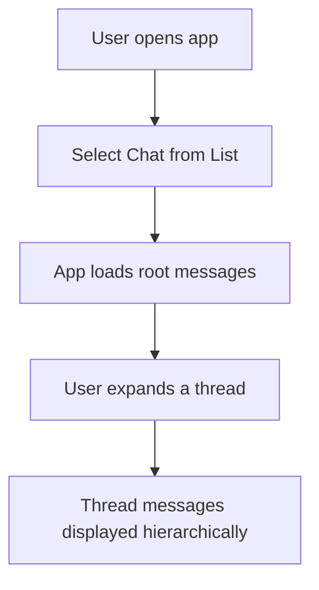

# Functional Design

## 1. Feature Summary

- 2-4 sentence description of what the feature enables for the user.
  E.g., “Enable users to view and expand threaded messages in Reddit style.”
- who is the user of the feature?

## 2. User Stories

Group user stories by user role.
Format: As a [user role], I want [action], so that [benefit].

Add epics → stories if needed.

Examples:

```
As a user I want to:
- See a list of chats so that I can choose which one to read.
- View root messages as main threads so that I can scan high-level topics quickly.

As an admin I want to:
- Upload chat files so I can preprocess new chats.

```

## 3. Functional Scope

### 3.1 Included Capabilities

### 3.2 Explicit Exclusions

## 4. Workflows Diagrams

Mermaid flowchart diagrams showing the interaction with the system. One diagram per user workflow. Avoid duplicates. Title each flow.

Example:



## 5. UI Draft Design

Low-fidelity is fine.

### 5.1. Component layout tree

Example:

```
App
├── ChatSelector
│   ├── ChatList               # List of available chats
│   └── ChatPreview            # Preview on hover (optional)
├── ThreadViewer
│   ├── RootMessageList        # Shows messages with no parent (depth = 0)
│   ├── MessageThreadTree      # Expandable tree of replies
│   │   ├── MessageCard        # Message + author + time
│   │   └── Children (indented under parent) [expand on click]
├── Controls
│   ├── ViewToggle             # Switch between Reddit / Facebook mode
│   ├── FilterOptions          # Author/date/tag filters
│   ├── SearchBar              # Instant client-side search
│   └── AdminPanel [visible only if admin]
│       ├── UploadJSON         # Upload Telegram export
│       └── ChatStats          # Show total threads/messages

```

### 5.2. ASCII wireframes

Example:

```
+------------------------------------------------+
| Chat Selector         |  Thread Viewer         |
|-----------------------+------------------------|
| - Chat 1              |  [Root Message 1]      |
| - Chat 2              |    ↳ Reply 1           |
| - Chat 3              |      ↳ Reply 1.1       |
|                       |  [Root Message 2]      |
|                       |    ↳ Reply 2.1         |
+-----------------------+------------------------+
| Controls: [Toggle View] [Search] [Filters]     |
+------------------------------------------------+
```

### 5.3. Notes on behavior

Examples:

```
- [ChatSelector] Collapsible
- [ThreadViewer] Expand thread on click
- [ThreadViewer] Scroll position is maintained
```

## 6. Acceptance Criteria (optional)

Format: Given... When... Then... -plain checklists.

Examples:

```
- [ ] When a user opens the app, they can see a list of available chats.
- [ ] When clicking a chat, it loads all root messages (reply_to_id = null).
- [ ] When clicking on a root message, its thread expands under it.
- [ ] Threads should remain open until explicitly collapsed.
```
