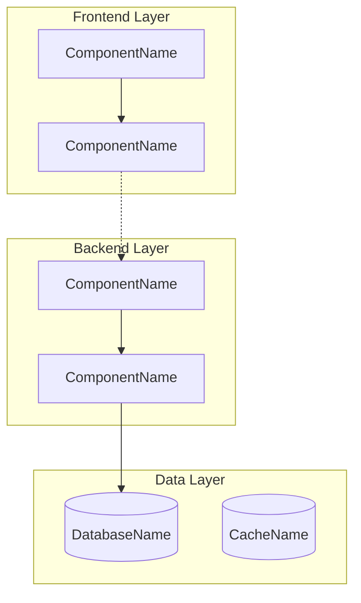

# Component Architecture Diagram

## Domain: {{DOMAIN_NAME}}

### System Overview

## Component Descriptions

### Frontend Components

- **F1.1 (ComponentName)**: Brief description of component purpose and responsibilities
- **F1.2 (ComponentName)**: Brief description of component purpose and responsibilities

### Backend Components

- **B1.1 (ComponentName)**: Brief description of component purpose and responsibilities
- **B1.2 (ComponentName)**: Brief description of component purpose and responsibilities

### Data Layer

- **D1 (DatabaseName)**: Type of database and primary purpose
- **D2 (CacheName)**: Type of cache and usage patterns

## Key Integration Points

- **Frontend ↔ Backend**: API endpoints, authentication, data flow
- **Backend ↔ Data**: Database connections, caching strategies
- **External Services**: Third-party integrations, external APIs

## Technology Stack

- **Frontend**: {{FRONTEND_TECH}}
- **Backend**: {{BACKEND_TECH}}
- **Database**: {{DATABASE_TECH}}
- **Infrastructure**: {{INFRASTRUCTURE_TECH}}

---
*Generated for SDD Flow Technical Design Step 5.3*