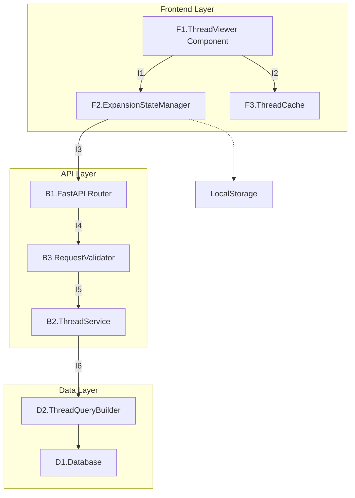
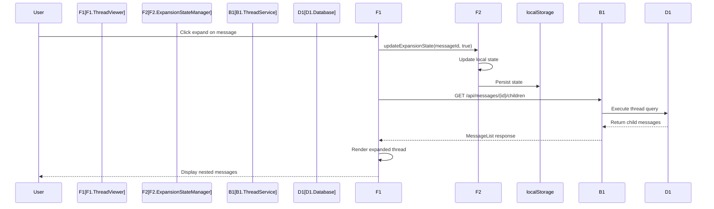
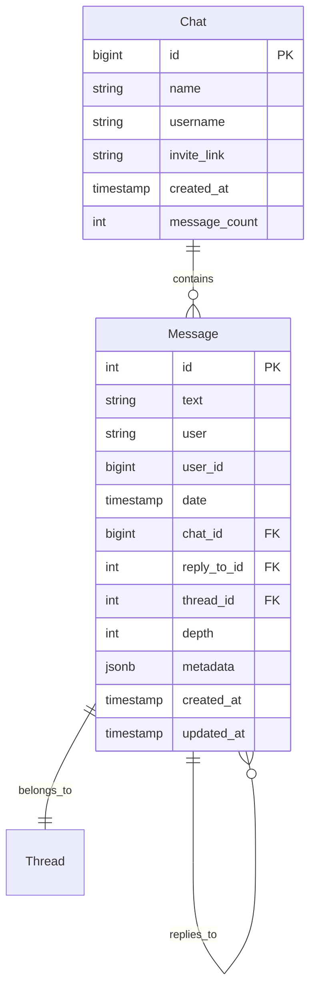
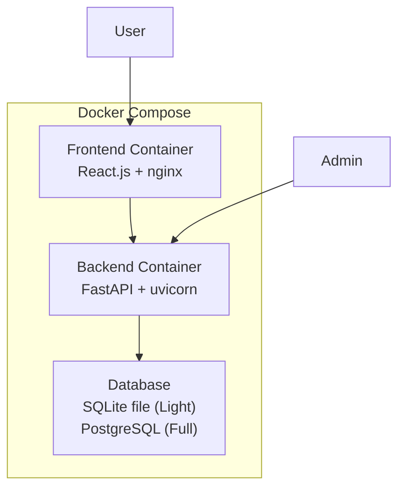

# Technical Design Document Template

_Project: [Project Name]_
_Feature/Module: [Feature Name]_
_Version: [Version Number]_
_Date: [Date]_

---

## Document Overview

**Purpose:** [Describe what this document achieves - typically defines technical implementation approach, component architecture, and data structures for the feature]

**Target Audience:** [Who will use this document - typically development team, AI coding agents, technical reviewers, and future maintainers]

**Prerequisites:** [What documents or knowledge are required before reading this - typically System Architecture Document, Functional Design Document, and Technology Stack familiarity]

---

## 1. Overview

<OVERVIEW>
### 1.1 Feature Summary
*Notes: Provide a brief 2-3 sentence description of what this feature does from a technical perspective. Focus on the core technical capability, not business value.*

**Example:**

```
The Thread Hierarchy Manager implements expandable/collapsible message threading for Telegram chat visualization, providing React components that consume FastAPI endpoints to render nested comment structures with independent branch state management.
```

### 1.2 Technical Approach

_Notes: Outline the high-level technical strategy and key architectural decisions. Include the main patterns, technologies, and approaches that will be used._

**Example:**

```
- Architecture Pattern: Component-based frontend with stateful expansion tracking
- Data Strategy: Pre-computed thread relationships stored in normalized database schema
- State Management: React hooks with local storage persistence for expansion states
- Performance Strategy: Lazy loading with virtual scrolling for large thread hierarchies
- all onther key details...
```

### 1.3 Scope & Dependencies

_Notes: Define what's included in this feature, what's explicitly excluded, and what other components or systems this feature depends on._

**Example:**

```
Included:
- Thread expansion/collapse UI components
- Branch state management system
- Thread hierarchy API endpoints

Excluded:
- Real-time updates (deferred to Phase 2)
- User authentication integration

Dependencies:
- Chat data ingestion system (already implemented)
- Message database schema (already implemented)
- React routing system (already implemented)
```

</OVERVIEW>

## 2. Component Architecture

<COMPONENT_ARCHITECTURE>

### 2.1 Reference Tables

#### 2.1.1 Component Reference Table

<COMPONENT_REFERENCE_TABLE>
Example:

```markdown
| ID  | Component Name        | Layer    | Description                       |
| --- | --------------------- | -------- | --------------------------------- |
| F1  | ThreadViewer          | Frontend | Thread viewer component           |
| F2  | ExpansionStateManager | Frontend | Expansion state manager component |
| B1  | ThreadService         | Backend  | Thread service component          |
| D1  | Database              | Data     | Database component                |
```

</component*reference_table>
\_Note: Consistently numerate the conponents with IDs. For frontend components - F1 (F1.ThreadViewer), F2, etc. For backend - B1, B2, etc For data - D1, etc. And use the same numeration in the rest of the document.*

#### 2.1.2 Component Interactions Reference Table

<COMPONENT_INTERACTIONS_REFERENCE_TABLE>
Example:

```markdown
| Interaction ID | Components | Description                             |
| -------------- | ---------- | --------------------------------------- |
| I1             | F1->B1->B2 | JWT authentication and token management |
```

</component_interactions_reference_table>

### 2.1 Component Overview Diagram

\*Notes:

- Create a Mermaid diagram showing the high-level components and their relationships. Include frontend, backend, data layer, etc. components with their interactions.
- All components ani interactions must be always shown with their IDs.\*

<COMPONENT_OVERVIEW_DIAGRAM>
**Example:**



</COMPONENT_OVERVIEW_DIAGRAM>

### 2.2 Component Specifications

<COMPONENT_SPECIFICATIONS>
For each layer of the application (frontend components, frontend services, backend services, data layer, etc.) provide the following:

#### 2.2.1 [Component Layer Name - e.g., Frontend Components]

_Notes: For each major component, provide its purpose, key responsibilities, and important interfaces (not internal methods). Include enough detail for developers and AI coding agents to understand how to implement it._

**[Component ID][Component Name]**

- **Purpose:** [Single sentence describing what this component does]
- **Implementation Details (optional):** [Implementation details]
- **Responsibilities/Features:** [Bullet list of key responsibilities/features]

Additionaly for frontend components:

- **External Inputs (Props):** [ List of external inputs (props) ]
- **Events/Callbacks (Props):** [ List of events/callbacks (props) ]
- **Internal State:** [ List of internal state and brief description of each]

#### 2.2.2 [Another Component Layer - e.g., Backend Services]

_Notes: Repeat the same structure for backend services, data access layers, etc._
</COMPONENT_SPECIFICATIONS>

### 2.3 Component Interaction Flow

_Notes: Create a Mermaid sequence diagram(S) showing how the components interact for a typical user action. This helps developers understand the data flow._

<COMPONENT_INTERACTION_FLOW>
**Example:**



**Data flow notes:**
_Notes: Provide any additional notes or remarks about the data flow._

</COMPONENT_INTERACTION_FLOW>

### 2.4 UI Component Tree

_A tree of actual UI components in ascii format. If a UI prototype is provided, include a tree of actual UI components _

<UI_COMPONENT_TREE>
Example:

```
F1. Dashboard App (app/page.tsx)
├── LoginView (components/login-view.tsx)
│   ├── Card
```

</UI_COMPONENT_TREE>

---

## 3. Data Models & Schemas

### 3.1 Data Contracts (DCs)

_Notes: Define the exact structure of data that flows between components (see 2. Component Architecture). Include both request and response models. All data contracts are language-agnostic and describe the structure of data exchanged between client and server, independent of implementation language or DTO conventions._

<DATA_CONTRACTS>

#### 3.1.1 <Interaction ID> : <Component1.ID.Component1 Name> -> <Component2.ID Component2.Name>

\*Notes:

- Define the structure of data sent TO your APIs and received FROM your APIs, including all protocols (REST, WebSockets, etc) and types (errors, etc)
- if request DC is empty, then create it anyway, but mark it as empty\*

- **Request:** <DC_ID.DC Name> (Component1.ID → Component2.ID)

  - field1:type
  - field2:type

- **Response:** <DC_ID.DC Name> (Component2.ID → Component1.ID)
  - field1:type
  - field2:type

**Example:**

```
##### I1 : <F1.Dashboard App> -> <B2.Auth Service>

- **Request:** <DC1-1.LoginRequest> (F1 → B2)
  - username: string
  - password: string
- **Response:** <DC1-2.LoginResponse> (B2 → F1)
  - access_token: string
  - token_type: string (always "bearer")
  - expires_in: integer (seconds)
```

</DATA_CONTRACTS>

### 3.2 Internal Component Models

_Notes: Define data structures used internally within components - React state, service layer objects, etc. These don't cross API boundaries but are important for implementation. IMPORTANT: This is section is skipped in the initial design and should be added as documenting the actual implementation!_

<COMPONENT_MODELS>

#### <Component> State Models

_Notes: For each major component type, define its internal data structures - interfaces, dataclasses, etc_

</COMPONENT_MODELS>

### 3.3 Persistence Model (Database Schema)

_Notes: Define the database schema including tables, relationships, and important indexes. Include migration scripts if schema changes are needed._

<PERSISTENCE_MODEL>

#### DB Entity Relationship Diagram

_Notes: Create a Mermaid ERD showing tables and relationships_
<ENTITY_RELATIONSHIP_DIAGRAM>
**Example:**



</entity_relationship_diagram>

#### Database Migrations

_Notes: Include any DDL statements needed to implement or modify the schema: tables and constraints. But omit indexes._

<MIGRATIONS>
**Example:**
```sql
-- Migration: Add thread performance indexes
CREATE TABLE IF NOT EXISTS messages (
    id SERIAL PRIMARY KEY,
    text TEXT NOT NULL,
    user VARCHAR(255) NOT NULL,
    user_id BIGINT NOT NULL,
    chat_id BIGINT NOT NULL,
    reply_to_id BIGINT,
    thread_id BIGINT NOT NULL,
    depth INT NOT NULL,
    metadata JSONB,
    created_at TIMESTAMP NOT NULL DEFAULT CURRENT_TIMESTAMP,
    updated_at TIMESTAMP NOT NULL DEFAULT CURRENT_TIMESTAMP
);
```
</MIGRATIONS>

## 4. API Endpoints

<API_ENDPOINTS>

### 4.1 Internal APIs

\*Notes: Define all API endpoints that are part of this feature. Include HTTP methods, URLs, parameters, request/response bodies - as reference to the DCs in the Data Models & Schemas section, and error codes. Use OpenAPI format or similar structured approach.

IMPORTANT: If a parameter is in the DC, do not repeat it in the API endpoint route, use post method instead with body parameters. And reference the respective DC\*

<INTERNAL_APIS>

#### [API Group Name - e.g., Thread Management Endpoints] (Component1.ID -> Component2.ID)

_Notes: For each logical group of endpoints, provide detailed specifications. IMPORTANT: Reference to the DCs in the Data Models & Schemas section, do not expand the DCs_

**Example:**

```yaml
# OpenAPI specification format
/api/chats/{chat_id}/roots:
  get:
    summary: Get root messages for a chat
    parameters:
      - name: chat_id
        in: path
        required: true
        schema:
          type: integer
    responses:
      200:
        content:
          application/json:
            schema:
              type: object
              properties:
                messages:
                  type: array
                  items:
                    $ref: '#/components/schemas/MessageResponse' (DC2-1.MessageResponse)
```

</INTERNAL_APIS>

### 4.2 Interface Contract Summary

_Notes: This table provides a high-level overview of the interface contracts between the UI and backend components. It includes the UI feature, the corresponding API endpoint, and any additional notes or remarks._

<interface_contract_summary>
| UI Feature | Endpoint | DC IDs | Notes |
| --- | --- | --- | --- |

</INTERFACE_CONTRACT_SUMMARY>

</API_ENDPOINTS>

### 4.3 External APIs & Integrations

_Notes: Define any external APIs that this feature calls, or any APIs that this feature exposes to external systems. Include authentication, rate limiting, and error handling details._

<EXTERNAL_APIS>

#### [Integration Name - e.g., Third-party Service Contracts]

_Notes: For each external integration, define the contract and implementation approach, including SDKs and docs references_

**Documentation and SDK:**
_Notes: Provide links to relevant documentation and SDKs_

**Connection Details:**
_Notes: Provide connection details, including endpoint, authentication, protocol, used by, model, etc_

**Example:**

```markdown
#### E1. OpenAI Realtime API Integration

**Documentation and SDK:**

- https://platform.openai.com/docs/api-reference/realtime
- https://github.com/openai/openai-python?tab=readme-ov-file#realtime-api-beta

**Connection Details:**

- **Endpoint:** wss://api.openai.com/v1/realtime
- **Authentication:** Bearer token in headers
- **Protocol:** WebSocket with JSON/binary messages
- **Used by:** B4 (Voice Service)
- **Model:** gpt-4o-mini
```

</EXTERNAL_APIS>

## 5. Deployment Architecture

<DEPLOYMENT_ARCHITECTURE>

### 5.1 Container Architecture

_Notes: Describe the container architecture for this feature_

**Example:**



### 5.2 Deployment Strategy

_Notes: Describe the deployment strategy for this feature. Containers, ports, volumes, etc_

Example:

- **Frontend**: React.js built assets served via nginx, port 80
- **Backend**: FastAPI with uvicorn ASGI server, port 8000
- **Database**: SQLite file mounted as volume in Backend container
- **Environment**: Single-server deployment with docker with compose plugin

**Deployment Command:**

```bash
# Using docker with compose plugin (not docker-compose)
docker compose up -d
```

</DEPLOYMENT_ARCHITECTURE>

## 6. Performance and Monitoring

<PERFORMANCE_AND_MONITORING>

**Performance Configuration:**
_Notes: Describe the performance configuration for this feature_

**Monitoring Setup (Basic Metrics):**
[yaml config]

**Key Metrics:**
Example:

- `voice_sessions_active`: Current active voice sessions in B4 (max 1)
- `call_duration_seconds`: Histogram of call durations from B5

</PERFORMANCE_AND_MONITORING>

## 7. Feature-Specific Security Assessment (optional)

_Notes: This section is optional but recommended for features that handle sensitive data or expose new attack surfaces. Identify and mitigate security risks introduced by this feature._

<SECURITY_ASSESSMENT>

### 7.1 Security Considerations

_Notes: Identify potential security risks and how they will be mitigated_

#### [Security Area - e.g., Input Validation]

_Notes: For each security concern, define the risk and mitigation approach_

#### [Security Area - e.g., Rate Limiting]

_Notes: Define rate limiting and abuse prevention measures_

### 7.2 Data Privacy

_Notes: Define how this feature handles sensitive data and privacy requirements_

**Example:**

```
- PII Handling: Message content treated as sensitive data
- Access Control: Thread access inherits chat permissions
- Audit Logging: Log thread access patterns for security monitoring
```

</SECURITY_ASSESSMENT>

## Appendices
